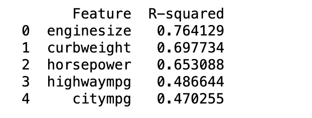
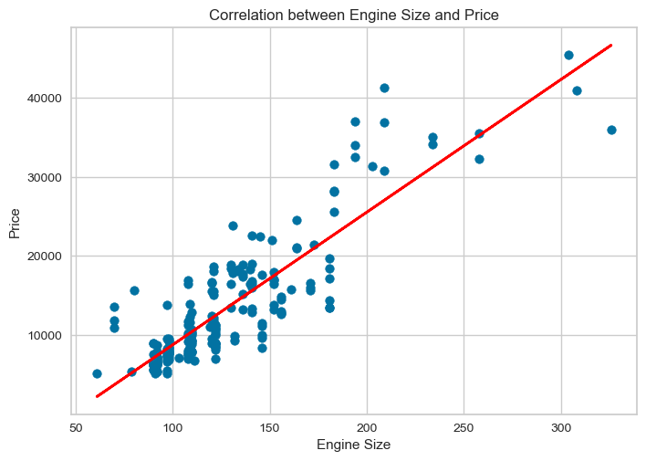
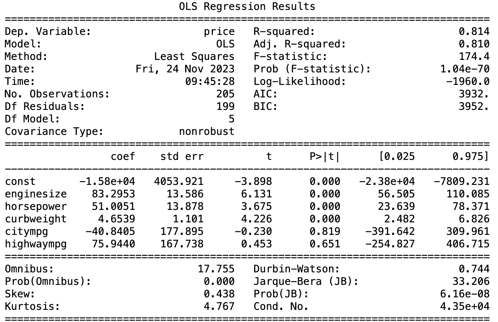
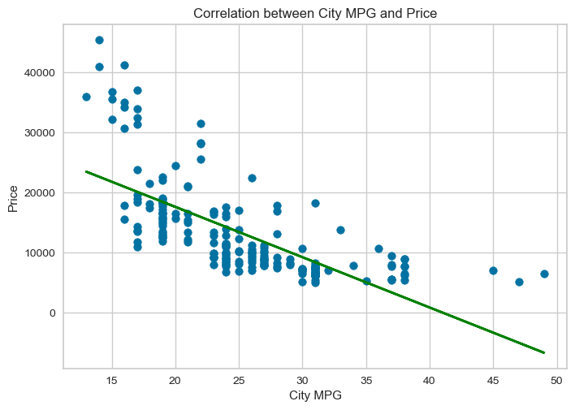
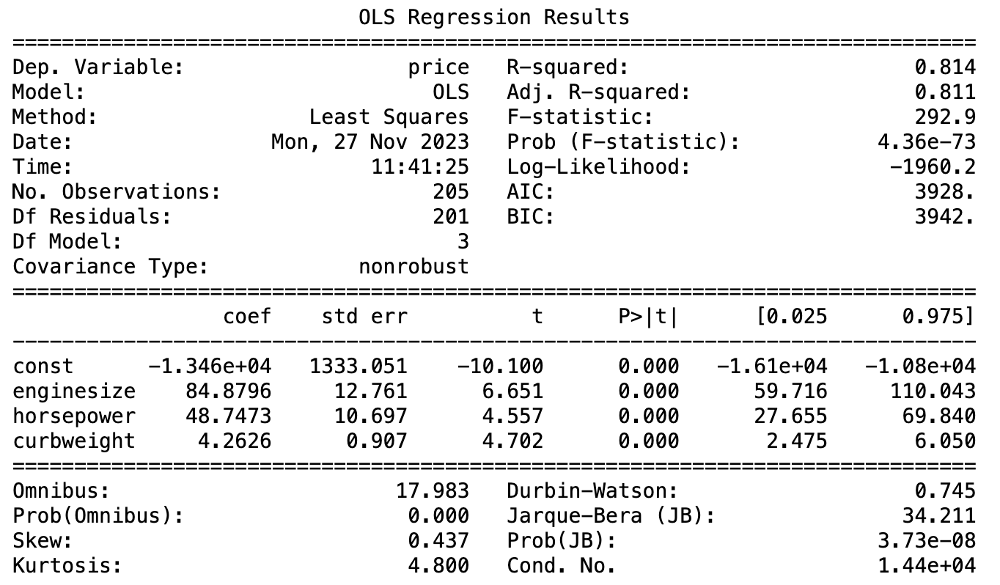

# Regression Analysis - Car Price Prediction

## Table of Contents
- [Problem Statement](#problem-statement)
- [Solution](#solution)
  - [Exploratory Data Analysis](#EDA)
  - [Modeling](#modeling)
    - [Model-1](#model1)
    - [Model-2](#model2)
    
- [Conclusion](#conclusion)
- [Acknowledgments](#acknowledgments)

## Problem Statement

**Regression Analysis of car prices in the US Automobile Market**

An automobile company is planning to enter the US automotive market. As part of their rigorous market research, they would like to get a thorough understanding of the key factors that drive the price of cars in the US. They collected a decent amount of data about the cars that are currently on the market, recording a diverse set of attributes. Create a regression model that can predict the price of a car from a set of selected features, and also analyze how much these features can explain the variations of car prices in the US.

## Solution

### Exploratory Data Analysis

We start off by exploring the data variables and see if there is any correlation between them by plotting the correlation matrix. It shows that the features __enginesize, curbweight, horsepower, carwidth, and carlength__ are positively correlated with price, whereas, __highwaympg and citympg__ are negatively correlated with price.

### Modeling

The next step is to compute the individual  $𝑅^2$ values for the most promising features we identified from the correlation matrix. These values can be used to interpret the factors that have an influence on the price of a car. We omitted __carwidth, carlength, and wheelbase__ because they all have a strong correlation with __curbweight__ and it makes sense to get rid of the redundant variables.

The best indicator of car price prediction is Engine size with  $𝑅^2$ approx 0.764

R-squared measures the strength of the relationship between your model and the dependent variable on a 0-100% scale. Since there appeared to be a strong relationship between engine size and the price of the car, a scatter plot was used to visualize this relationship. The scatter plot shows a positive correlation between engine size and price. Also, it can be seen that the data points are closer to the regression line.

### Model-1

Next, We develop a multiple regression equation using __enginesize, horsepower, curbweight, citympg, and highwaympg__ to estimate __price__ and check how well the regression model explains the variability in price compared to the individual $R^2$.

$$ price = \ 83.29x_1+51.00x_2+4.65x_3 -40.84x_4+75.94x_5-15800\ $$

where  $𝑥_1$ represents enginesize,  $𝑥_2$ represents horsepower,  $𝑥_3$ represents curbweight,  $𝑥_4$ epresents citympg,  $𝑥_5$ represents highwaympg.

The  $𝑅^2$ value for this multiple regression model is 0.814. When a regression model accounts for more of the variance, the data points are closer to the regression line. When we used a single variable alone for the prediction the highest  $𝑅^2$ value that we got was 0.764, whereas the multiple regression gave us better $R^2$.

The coefficient t-value for engine size, horsepower, and curb weight are far away from zero, this indicates how many standard deviations the coefficient is from zero. A high absolute t-value indicates that the coefficient is likely significant. So we could easily reject the null hypothesis, that is we could declare a relationship between these variables and the price of the car. We do not have to consider the variables that have a t-value closer to zero for predicting the price. Since these variables do not indicate any stronger relationship in predicting the price. From the above summary, it is clear that __enginesize, horsepower, and curbweight are significant at $\alpha$ 0.001__. 

It appears to be there is a negative correlation between city mpg and price from the correlation matrix plotted above. Furthermore, the linear model also shows that city mpg has a negative impact on the prediction of price.

To interpret this more easily, a scatter plot of price against city mpg is plotted. It appears to be there is a negative relationship between city mpg and price. Also, the observations are not fitted closer to the regression line.

The above model gives a clearer image of which factors affect the pricing of cars. From the model, we could say that some variables are not significant for the prediction of the car price.

In order to understand the effect of citympg and highwaympg, we developed another model removing those variables and observed how $R^2$ varies.

#### Model-2

The second model regression equation is :

$$ price = \ 84.87x_1+48.75x_2+4.26x_3-13460\ $$

where $x_1$ is the __enginesize__, $x_2$ is the __horsepower__, and $x_3$ is the __curbweight__. All these three variables are significant at $\alpha=0.001$ or 99.9% confidence level. Also, the $R^2$ value is 0.8143 which means 81.4% of the variability in car price is explained by this model. There is no difference in $R^2$   at all when comparing the first and the second model.

Since there is no difference in R-squared value, It is better to use the second model for the car price prediction because it is a simpler one.

## Conclusion

From the analysis, we found out that the variables that have a major impact on the variances in car prices are enginesize, curbweight, and horsepower. The $R^2$ of the model is high, with 81.4%. This model is significant at $\alpha$ = 0.001 or 99.9% level.
