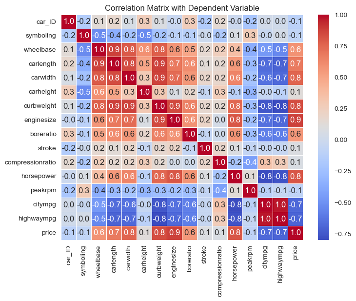

# Regression Analysis - Car Price Prediction

## Table of Contents
- [Problem Statement](#problem-statement)
- [Solution](#solution)
  - [Exploratory Data Analysis](#EDA)
  - [Modeling](#modeling)
- [Conclusion](#conclusion)
- [Acknowledgments](#acknowledgments)

## Problem Statement

**Regression Analysis of car prices in the US Automobile Market**

An automobile company is planning to enter the US automotive market. As part of their rigorous market research, they would like to get a thorough understanding of the key factors that drive the price of cars in the US. They collected a decent amount of data about the cars that are currently on the market, recording a diverse set of attributes. Create a regression model that can predict the price of a car from a set of selected features, and also analyze how much these features can explain the variations of car prices in the US.

## Solution

### Exploratory Data Analysis

We start off by exploring the data variables and see if there is any correlation between them by plotting the correlation matrix. It shows that the features __enginesize, curbweight, horsepower, carwidth, and carlength__ are positively correlated with price, whereas, __highwaympg and citympg__ are negatively correlated with price.

